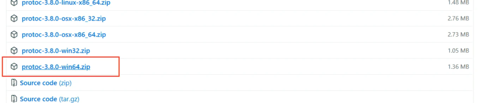
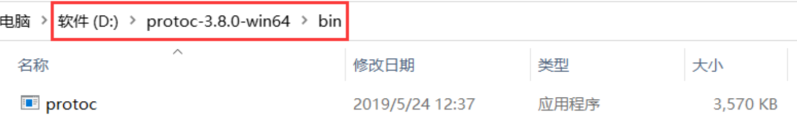
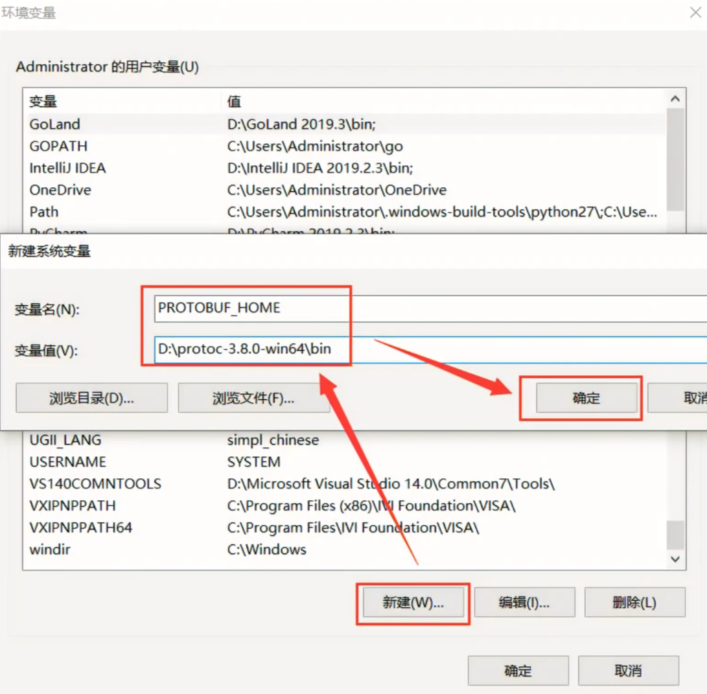
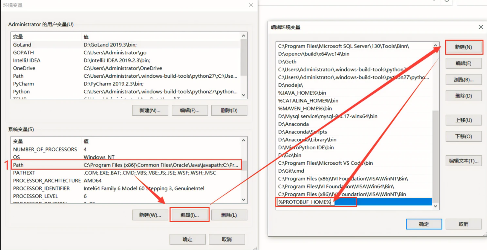

1.下载protobuf
到https://github.com/protocolbuffers/protobuf/releases下载对应的安装包

这里以3.8.0版本为例

下载完成后解压到D盘

配置环境变量：

变量名：PROTOBUF_HOME

变量值：D:\protoc-3.8.0-win64\bin

找到系统变量中的path变量，选中后点击编辑，在新建的内容中输入：%PROTOBUF_HOME%

执行：
1. go get google.golang.org/protobuf
2. go install google.golang.org/protobuf/cmd/protoc-gen-go@v1.28 
3. go install google.golang.org/grpc/cmd/protoc-gen-go-grpc@v1.2
安装不了配置代理
1. go env -w GO111MODULE=on
2. go env -w GOPROXY=https://goproxy.cn,direct     
